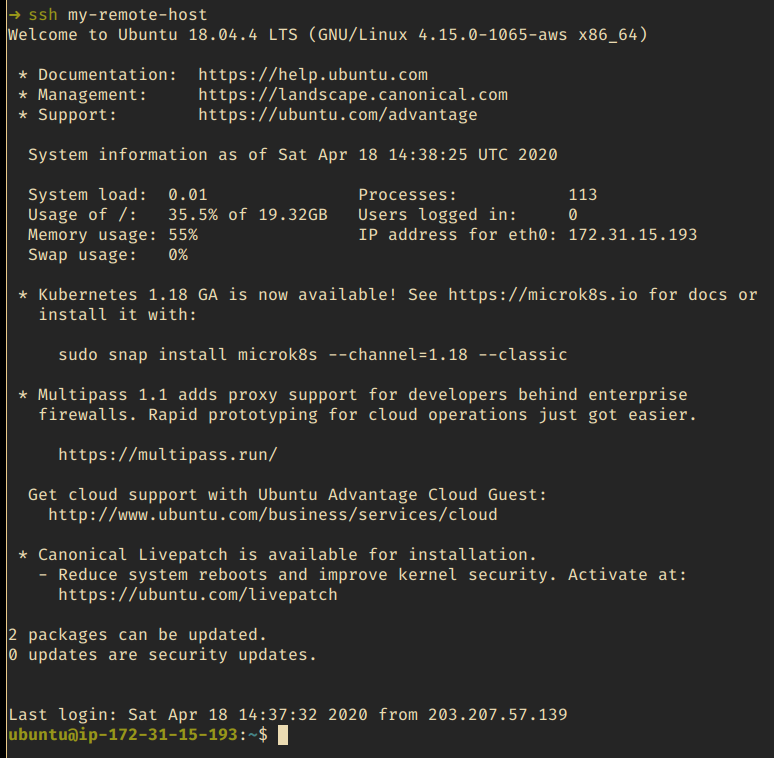
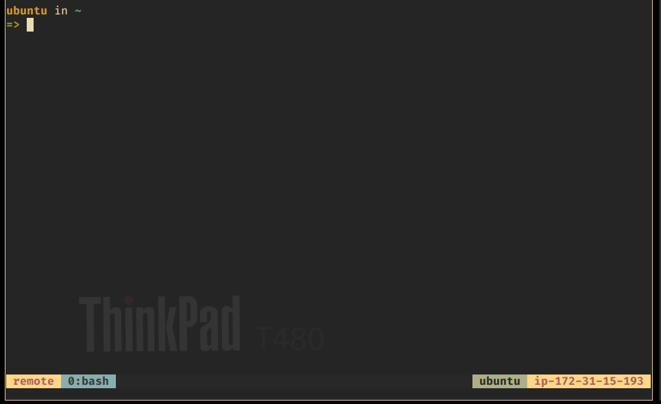

# Starship and Tmux

This is a little script designed to make your SSH session a little more enjoyable. Basically this script will install [starship prompt](https://starship.rs), tmux, and several tmux plugins using [tpm](https://github.com/tmux-plugins/tpm), plus a custom tmux config.

## Screenshot

## Prerequisities

 - git
 - curl

## installation

1. SSH to your destination host like usual
2. Run `curl -fsSL https://bit.ly/3bfeeGJ | bash`
3. Run `source ~/.bashrc` or just disconnect and reconnect your SSH session
